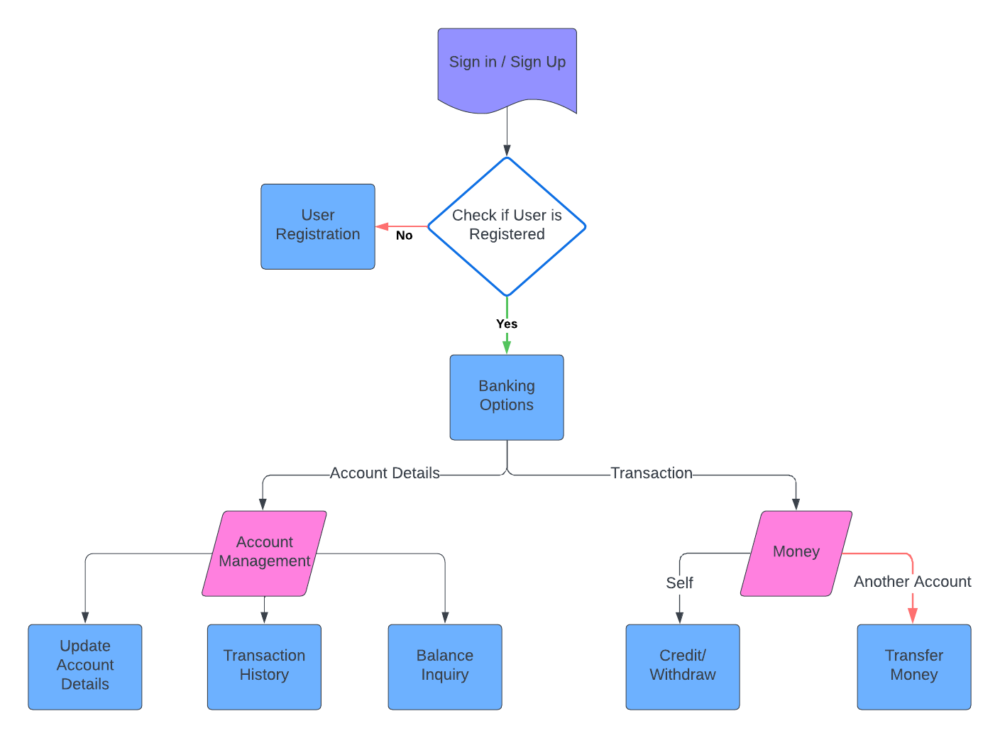

# Bank-Management-System

## Objective: 
To understand OOP concepts using Python by implementing a simple Bank Management system that has the following functionalities- User registration (SignUp/SignIn), Banking services for transactions and account updation.

## Project Flowchart

## How to Execute:
I would recommend running the files in this order:

database.py --> customer.py --> register.py --> bank.py --> main.py

Once you've run the main program, you'd be asked to SignUp/SignIn and accordingly you may add user data and upon SignIn, you can perform any of the banking options- Balance Enquiry, Cash Deposit/Withdrawal from self account, Fund Transfer to another account, 
and updating account details such as city, contact number and password.

## Output 

